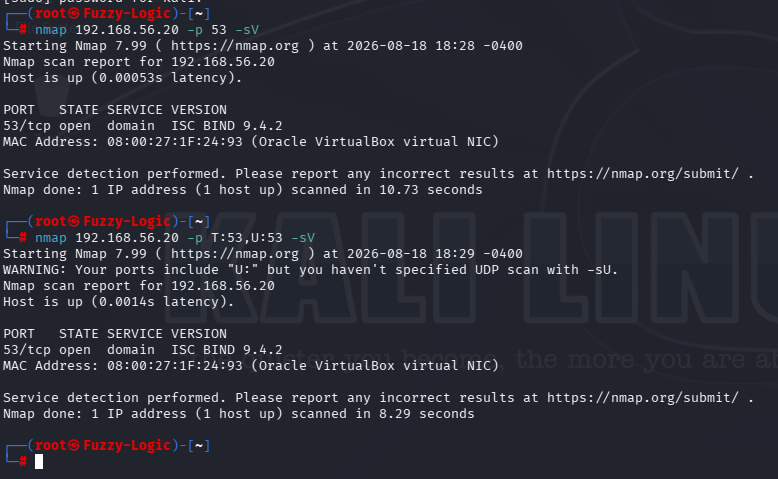
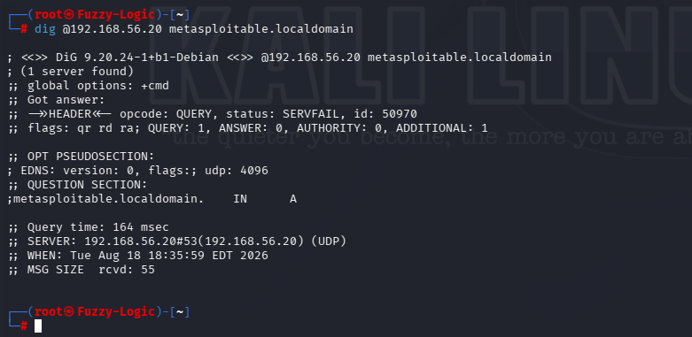
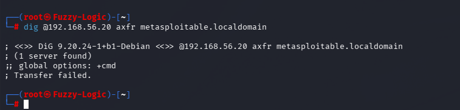

# DNS Security Findings

## Overview

The DNS service exposed by the Metasploitable 2 host was assessed through service detection, direct DNS queries and an AXFR zone-transfer test.

The assessment identified three primary security considerations:

1. **Legacy DNS Software**
2. **DNS Service Exposure**
3. **AXFR Zone Transfer Configuration**

The AXFR test was explicitly performed and rejected by the server. Therefore, no unrestricted zone-transfer vulnerability was confirmed.

No exploitation or unauthorized DNS access was performed as part of this assessment.

---

## Finding 01 — Legacy DNS Software

### Description

The target was running **ISC BIND 9.4.2**, a legacy DNS implementation identified through Nmap service and version detection.

### Evidence

The DNS service and version were identified through Nmap:



The detected service was:

```text
53/tcp open domain ISC BIND 9.4.2
```

### Security Impact

Running obsolete network-facing software increases the risk of exposure to known vulnerabilities and means that the service lacks security improvements introduced in subsequently supported releases.

The DNS service should therefore be considered part of the host's legacy software exposure.

### Severity

**Medium**

The severity reflects the use of obsolete network-facing DNS software. No direct compromise was demonstrated during this assessment.

### Recommendation

- Upgrade BIND to a currently supported version.
- Maintain the underlying operating system with current security updates.
- Remove obsolete packages and services.
- Establish a regular patch and vulnerability management process.
- Review DNS configuration after upgrading the software.

---

## Finding 02 — DNS Service Exposure

### Description

The target exposed a DNS service on TCP/53 and responded to direct DNS queries.

A direct query was performed against the target DNS server using:

```bash
dig @192.168.56.20 metasploitable.localdomain
```

The server processed the query and returned a DNS response.

### Evidence

The direct DNS query is documented here:



The observed response included:

```text
;; ->>HEADER<<- opcode: QUERY, status: SERVFAIL
```

The result demonstrates that the DNS service was reachable and processing DNS requests.

### Security Impact

An exposed DNS service provides an additional network-facing interface that must be appropriately configured and restricted.

DNS responses can also disclose information about the infrastructure depending on the records and configuration exposed to clients.

The `SERVFAIL` response observed during this query does not itself represent a security vulnerability.

### Severity

**Low**

The finding represents service exposure and configuration review requirements rather than a demonstrated compromise.

### Recommendation

- Restrict DNS access to authorized networks where appropriate.
- Expose only the DNS functionality required by the environment.
- Review DNS records for unnecessary information disclosure.
- Separate internal and external DNS zones where appropriate.
- Monitor DNS requests for unusual enumeration activity.

---

## Finding 03 — AXFR Zone Transfer Configuration

### Description

An AXFR zone-transfer request was explicitly tested against the `metasploitable.localdomain` DNS zone.

The following command was used:

```bash
dig @192.168.56.20 axfr metasploitable.localdomain
```

The server rejected the request:

```text
; Transfer failed.
```

### Evidence

The rejected AXFR request is documented here:



### Security Impact

An unrestricted AXFR transfer can potentially disclose the complete contents of a DNS zone, including hostnames, IP addresses and other infrastructure information.

However, the observed behaviour in this assessment was that the AXFR request was rejected.

Therefore, **no unrestricted zone-transfer vulnerability was confirmed**.

This represents a positive security observation rather than a confirmed vulnerability.

### Severity

**Informational**

The test was performed specifically to determine whether unrestricted zone transfers were permitted, and the observed result indicates that the request was denied.

### Recommendation

- Continue restricting AXFR requests to authorized secondary DNS servers.
- Explicitly define which hosts are permitted to perform zone transfers.
- Review BIND zone-transfer configuration regularly.
- Monitor DNS logs for repeated unauthorized AXFR requests.

---

## Information Disclosure Considerations

DNS services can disclose infrastructure information through legitimate DNS queries.

During this assessment, the server exposed its hostname and DNS implementation through service detection and protocol responses.

However, no unrestricted zone transfer was obtained.

The assessment therefore does not claim that the DNS service exposed a complete internal zone or infrastructure map.

### Recommendation

- Review publicly accessible DNS records.
- Avoid unnecessarily exposing internal infrastructure details.
- Use separate internal and external DNS zones where appropriate.
- Minimize information disclosed by DNS configuration where practical.

---

## Overall Assessment

The DNS service was successfully identified and assessed on the target.

The assessment confirmed that:

- ISC BIND 9.4.2 was exposed on TCP/53.
- The DNS service accepted direct DNS queries.
- The observed DNS query returned a `SERVFAIL` response.
- An AXFR zone-transfer request was explicitly tested.
- The AXFR request was rejected.
- No unrestricted zone-transfer vulnerability was confirmed.

The primary security concerns are therefore the use of **legacy DNS software** and the need to ensure that DNS exposure and configuration remain appropriately restricted.

The AXFR test provides a positive security observation: the attempted unrestricted zone transfer was denied.

No exploitation or unauthorized DNS access was performed during this assessment.
