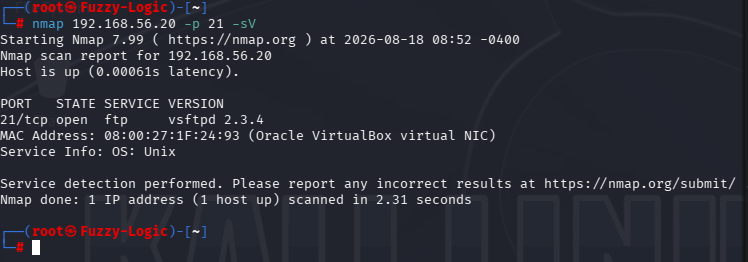
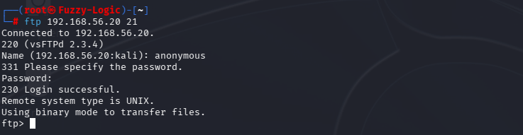
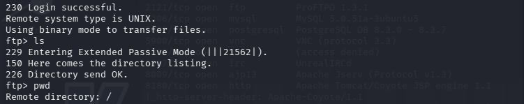

# FTP Enumeration

## Service Information

* **Service:** FTP
* **Port:** TCP/21
* **Software:** vsftpd
* **Version:** 2.3.4

## Service Discovery

The FTP service was identified during the reconnaissance phase using Nmap.

The service-specific scan was performed with:

```bash
nmap 192.168.56.20 -p 21 -sV
```

Nmap identified the following service:

```text
21/tcp open ftp vsftpd 2.3.4
```

The detected version indicated that the target was running an obsolete release of vsftpd and warranted further service enumeration.

The corresponding evidence is available here:



## Anonymous Authentication

After identifying the FTP service, an FTP connection was established to determine whether anonymous authentication was permitted.

Anonymous login was successfully accepted by the server.

This confirmed that the FTP service allowed unauthenticated access through the anonymous FTP account.

The relevant evidence is documented in the corresponding screenshot:



## Directory Enumeration

After establishing anonymous access, the available FTP directory contents were enumerated.

The purpose of this step was to determine whether anonymous access exposed files or directories that could provide additional information about the target.

This assessment therefore followed the following progression:

```text
FTP service discovered
        ↓
Anonymous authentication tested
        ↓
Anonymous access confirmed
        ↓
FTP directory contents enumerated
```

The directory listing was documented as part of the service assessment evidence:



## Enumeration Findings

The FTP enumeration identified two relevant characteristics:

* The service was running **vsftpd 2.3.4**, an obsolete software version.
* **Anonymous FTP authentication was enabled**, allowing access without a standard user account.

These observations were subsequently considered during the vulnerability and security assessment phases.

## Evidence

The FTP enumeration evidence consists of:

* Nmap service detection
* Anonymous FTP login
* FTP directory listing

The screenshots are stored in the project's evidence directory and referenced from the corresponding findings where applicable.
