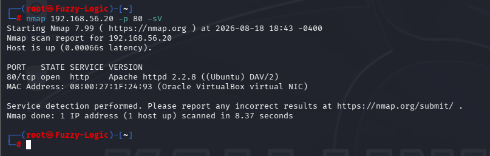
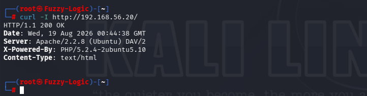
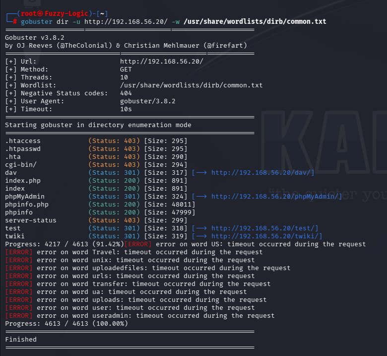
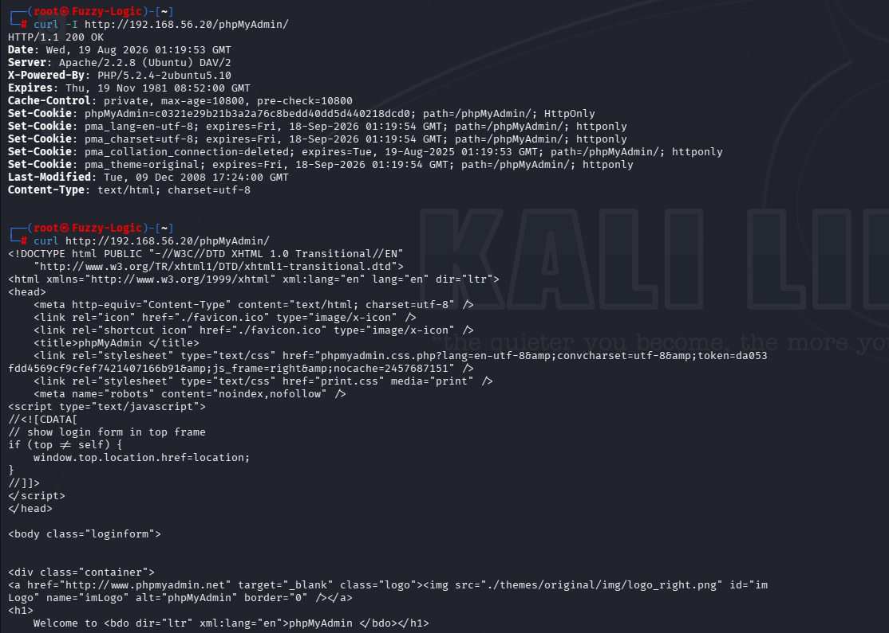
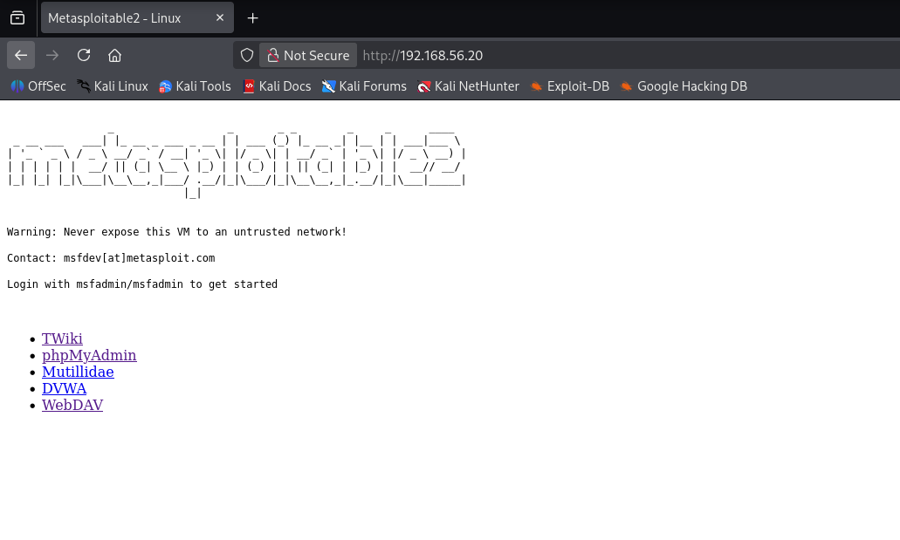

# HTTP Security Findings

## Overview

The HTTP service exposed by the Metasploitable 2 host presented several security weaknesses and security-hardening concerns identified during the service assessment.

The assessment identified four primary findings:

1. **Outdated Web Server and PHP Software**
2. **Web Application and Resource Exposure**
3. **Information Disclosure Through HTTP Responses**
4. **Potentially Sensitive Web Resources**

The findings were identified through service detection, HTTP header inspection, web-content analysis, directory enumeration and application identification.

No exploitation, authentication bypass, unauthorized database access or persistence was performed during this assessment.

---

## Finding 01 — Outdated Web Server and PHP Software

### Description

The target was running an obsolete Apache HTTP Server and PHP implementation.

Nmap identified:

```text
80/tcp open http Apache httpd 2.2.8 ((Ubuntu) DAV/2)
```

HTTP response headers also disclosed:

```text
Server: Apache/2.2.8 (Ubuntu) DAV/2
X-Powered-By: PHP/5.2.4-2ubuntu5.10
```

### Evidence

The Apache version was identified through Nmap:



The Apache and PHP versions were also disclosed through HTTP response headers:



### Security Impact

Running obsolete network-facing software increases the risk of exposure to known vulnerabilities and means that the system lacks security improvements introduced in subsequently supported releases.

The risk is increased because both the web server and the PHP runtime are exposed through a network-accessible HTTP service.

### Severity

**High**

The severity reflects the exposure of obsolete web-server and scripting-runtime software. No exploitation was performed during this assessment.

### Recommendation

- Upgrade Apache HTTP Server to a currently supported version.
- Upgrade PHP to a currently supported version.
- Maintain the underlying operating system with current security updates.
- Remove obsolete packages and applications.
- Establish a regular patch and vulnerability management process.

---

## Finding 02 — Web Application and Resource Exposure

### Description

The HTTP service exposed multiple web applications and resources through the same web server.

The root web page disclosed links to applications and services including:

```text
/twiki/
/phpMyAdmin/
/mutillidae/
/dvwa/
/dav/
```

Directory enumeration also identified additional accessible and redirected resources.

### Evidence

The web content retrieved from the server disclosed multiple hosted applications:


Gobuster identified multiple resources returning HTTP 200 or HTTP 301 responses:



### Security Impact

Exposing multiple applications through a single HTTP service increases the overall attack surface.

Applications that are obsolete, unnecessary, poorly configured or insufficiently maintained may introduce additional vulnerabilities or administrative interfaces.

The assessment identified the applications and resources but did not attempt to exploit them.

### Severity

**Medium**

The finding reflects increased attack surface and application exposure rather than a demonstrated compromise.

### Recommendation

- Remove unnecessary web applications.
- Remove sample and demonstration applications from production systems.
- Restrict administrative interfaces to authorized users and networks.
- Regularly review deployed applications and web directories.
- Maintain all hosted applications with current security updates.
- Apply network segmentation where appropriate.

---

## Finding 03 — Information Disclosure Through HTTP Responses

### Description

The HTTP service disclosed technical information through both HTTP headers and web-page content.

The response headers identified:

```text
Apache/2.2.8 (Ubuntu) DAV/2
PHP/5.2.4-2ubuntu5.10
```

The web page also disclosed information about the installed applications and the laboratory environment.

### Evidence

The HTTP headers disclosed the server and PHP implementation:


The web page content disclosed additional information about the environment and hosted applications:


### Security Impact

Implementation details disclosed through HTTP responses can assist attackers during reconnaissance.

Information such as server versions, scripting runtimes, hostnames and installed applications can help identify technologies that may require further investigation.

The information disclosure does not by itself demonstrate a direct compromise.

### Severity

**Low–Medium**

The finding primarily concerns reconnaissance and information exposure.

### Recommendation

- Minimize unnecessary server and software version disclosure where practical.
- Remove unnecessary technical information from publicly accessible pages.
- Avoid exposing internal infrastructure details.
- Remove default or demonstration content from production systems.
- Keep exposed software fully patched.

---

## Finding 04 — Potentially Sensitive Web Resources

### Description

Directory enumeration identified several resources that warrant additional security review.

Gobuster identified accessible resources including:

```text
/phpinfo.php
/phpinfo
/test
```

Additional resources returned HTTP 301 redirects:

```text
/dav/
/phpMyAdmin/
/twiki/
```

Restricted resources returned HTTP 403:

```text
/.htaccess
/.htpasswd
/.hta
/cgi-bin/
/server-status
```

The assessment also confirmed that phpMyAdmin was accessible through the web server.

### Evidence

The Gobuster enumeration identified the resources:


phpMyAdmin was subsequently identified through its web interface:



The browser-based web access was also verified:



### Security Impact

Some of the identified resources can expose significant technical information or administrative functionality if improperly configured.

For example, PHP information pages may disclose configuration details, loaded modules, filesystem paths and other implementation information.

Administrative applications such as phpMyAdmin should also be strictly controlled because they provide access to database-management functionality.

The HTTP 403 responses observed for `.htaccess`, `.htpasswd`, `.hta`, `cgi-bin` and `server-status` demonstrate that these resources exist but were access-restricted.

The assessment therefore does **not** claim that the contents of these restricted resources were accessible.

### Severity

**Medium**

The severity reflects the presence of potentially sensitive resources and administrative functionality exposed through the web server, without demonstrating unauthorized access.

### Recommendation

- Remove unnecessary `phpinfo` pages from production environments.
- Restrict phpMyAdmin to authorized administrative networks and users.
- Remove unnecessary test and demonstration resources.
- Disable directory listing where it is not required.
- Restrict sensitive administrative endpoints.
- Review access controls for all discovered resources.
- Monitor HTTP access logs for suspicious enumeration activity.

---

## Evidence Handling and Redaction

One of the HTTP evidence screenshots originally contained default laboratory credentials displayed by the Metasploitable environment.

Before publication to the public GitHub repository, those credential values were visually redacted.

The redaction was performed using an AI-assisted image-editing tool.

The resulting image is a sanitized version of the original evidence. The redaction does not alter the technical information relevant to the finding and was performed solely to prevent credentials from being unnecessarily exposed in the public repository.

The original laboratory credentials were not used as evidence of a vulnerability and are not required to understand the HTTP findings.

---

## Overall Assessment

The HTTP service represents a significant security concern due to the combination of obsolete software, multiple exposed applications, information disclosure and potentially sensitive web resources.

The assessment confirmed that:

- Apache HTTP Server 2.2.8 was exposed on TCP/80.
- PHP 5.2.4 was disclosed through HTTP response headers.
- Multiple web applications were exposed through the same HTTP service.
- Gobuster identified multiple accessible, redirected and restricted resources.
- PHP information pages were exposed.
- phpMyAdmin was accessible through the web server.
- Several resources returned HTTP 403, demonstrating that access controls existed for those endpoints.
- The web service was accessible through both command-line tools and a standard browser.
- Credentials visible in the original laboratory page were redacted before the evidence was published.

The primary remediation priorities are to upgrade obsolete software, remove unnecessary applications and resources, restrict administrative interfaces, minimize information disclosure and regularly review the exposed web attack surface.

No exploitation, authentication bypass, unauthorized database access or persistence was performed during this assessment.
