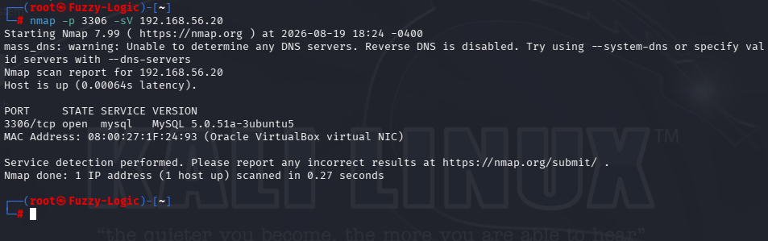
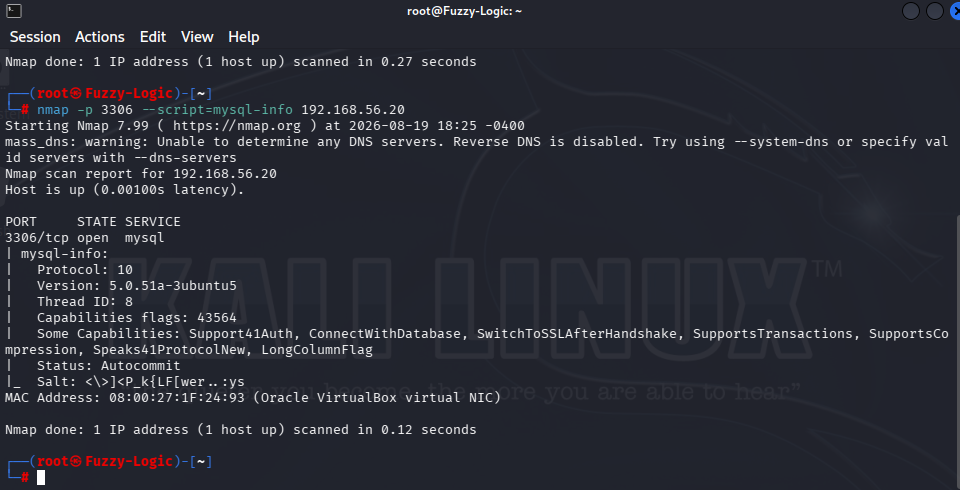
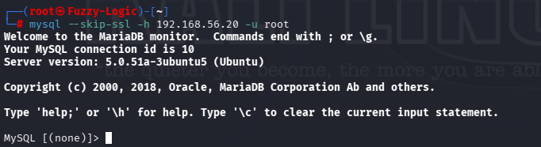
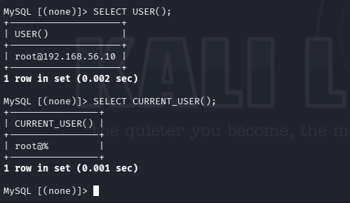
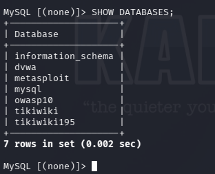
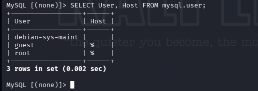
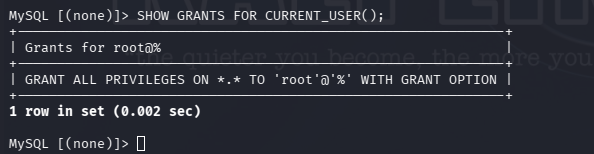
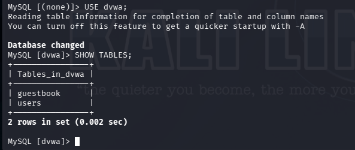

# MySQL Enumeration

## Service Information

- **Service:** MySQL
- **Port:** TCP/3306
- **Target:** Metasploitable 2
- **Version identified:** MySQL 5.0.51a-3ubuntu5
- **Authentication:** Remote root access
- **Database access:** Confirmed
- **Privilege level:** root@% with ALL PRIVILEGES and GRANT OPTION

## 1. Service Discovery

We first identified the service running on TCP/3306.

**Command used**

```bash
nmap -p 3306 -sV 192.168.56.20
```

Nmap identified:

```text
3306/tcp open mysql MySQL 5.0.51a-3ubuntu5
```



This established that the target was exposing a MySQL database service over TCP/3306.

## 2. MySQL Service Enumeration

We then used Nmap's MySQL information script to obtain additional information about the database server.

**Command used**

```bash
nmap -p 3306 --script=mysql-info 192.168.56.20
```

The scan identified:

```text
Protocol: 10
Version: 5.0.51a-3ubuntu5
```

The response also indicated support for:

```text
SwitchToSSLAfterHandshake
```



This provided additional information about the legacy MySQL implementation and its connection capabilities.

## 3. Initial MySQL Connection

We initially attempted to connect using the standard MySQL client:

```bash
mysql -h 192.168.56.20 -u root
```

The client returned:

```text
ERROR 2026 (HY000): TLS/SSL error: wrong version number
```

This was a **client/server compatibility issue**, rather than evidence that authentication had failed.

The target was running a very old MySQL implementation, while the Kali client was significantly newer.

No separate screenshot was required for this failed connection.

## 4. Remote MySQL Connection with SSL Disabled

We then retried the connection with SSL explicitly disabled:

```bash
mysql --skip-ssl -h 192.168.56.20 -u root
```

The connection succeeded:

```text
Welcome to the MariaDB monitor.

Server version: 5.0.51a-3ubuntu5 (Ubuntu)
```

Most importantly, no password was requested.



This demonstrated that the target accepted a remote MySQL connection using the `root` account without requiring a password.

## 5. Confirming the Connected Identity

Once connected, we verified the identity associated with the session.

### USER()

**Command used**

```sql
SELECT USER();
```

The result was:

```text
root@192.168.56.10
```

This establishes that the connection originated from the Kali system at `192.168.56.10`.

### CURRENT_USER()

We then checked the MySQL account actually used for authorization.

**Command used**

```sql
SELECT CURRENT_USER();
```

The result was:

```text
root@%
```



The `%` wildcard is particularly significant because it indicates that the account is configured to accept connections from arbitrary hosts, subject to surrounding network controls.

## 6. Database Enumeration

We then enumerated the databases visible to the connected account.

**Command used**

```sql
SHOW DATABASES;
```

The server returned databases including:

```text
information_schema
dvwa
metasploit
mysql
owasp10
tikiwiki
tikiwiki195
```



This demonstrated that the connected account had visibility across multiple databases hosted on the target.

## 7. Enumerating MySQL Accounts

We then inspected the MySQL user table.

**Command used**

```sql
SELECT User, Host FROM mysql.user;
```

The result included:

```text
debian-sys-maint
guest
root
```

with the root account configured as:

```text
root    %
```



The `%` host wildcard is significant because the administrative account was not restricted to localhost.

## 8. Reviewing Root Privileges

We then checked the privileges assigned to the currently authenticated account.

**Command used**

```sql
SHOW GRANTS FOR CURRENT_USER();
```

The result was:

```text
GRANT ALL PRIVILEGES ON *.* TO 'root'@'%' WITH GRANT OPTION
```



This is the strongest piece of evidence in the MySQL assessment.

The account had:

```text
ALL PRIVILEGES
```

over:

```text
*.*
```

meaning all databases and tables.

It also had:

```text
WITH GRANT OPTION
```

which allows the account to potentially delegate its privileges to other accounts.

## 9. Accessing the DVWA Database

We then demonstrated that the database access was not merely theoretical.

**Command used**

```sql
USE dvwa;
```

The server responded:

```text
Database changed
```

We then enumerated the tables:

```sql
SHOW TABLES;
```

The result included:

```text
guestbook
users
```



This demonstrates access to an actual application database hosted on the target.

## Security Analysis

The assessment established the following chain:

```text
TCP/3306 exposed
        ↓
MySQL 5.0.51a identified
        ↓
Remote root connection succeeds
        ↓
No password requested
        ↓
CURRENT_USER() → root@%
        ↓
Multiple databases accessible
        ↓
Root account has ALL PRIVILEGES
        ↓
GRANT OPTION enabled
        ↓
DVWA database accessible
```

The primary security concern is therefore not simply the age of the MySQL version.

The critical issue is the combination of:

- Remote root access.
- No password required for the successful connection.
- `root@%` host wildcard.
- `ALL PRIVILEGES` over `*.*`.
- `WITH GRANT OPTION`.
- Access to multiple application databases.

## Security Assessment Summary

### Remote Root Access

The server accepted a remote connection using the `root` account without requesting a password.

**Impact:**

A remote user capable of reaching TCP/3306 could potentially obtain administrative database access.

### Root Account Allowed from Any Host

The authenticated account was:

```text
root@%
```

**Impact:**

The administrative account was not restricted to localhost or a specific trusted host.

### Excessive Privileges

The account had:

```text
ALL PRIVILEGES ON *.*
WITH GRANT OPTION
```

**Impact:**

The account had administrative privileges across all databases and could potentially delegate those privileges to other accounts.

### Database Exposure

Multiple databases were visible, including the `dvwa` application database.

**Impact:**

Compromise of the database account could expose application data and potentially sensitive information stored within the hosted databases.

## Scope and Limitations

The assessment was conducted against the intentionally vulnerable Metasploitable 2 laboratory environment.

Testing was limited to:

- Service identification.
- Version enumeration.
- Authentication validation.
- Account and host enumeration.
- Database enumeration.
- Privilege validation.
- Access validation against the DVWA database.

No destructive database actions were performed.

No data was modified or deleted during the assessment.

## Evidence

The MySQL assessment uses eight screenshots:

```text
11_MYSQL01_nmap_mysql_detection.png
11_MYSQL02_mysql_version_enumeration.png
11_MYSQL03_remote_mysql_root_access.png
11_MYSQL04_mysql_remote_root_identity.png
11_MYSQL05_mysql_database_enumeration.png
11_MYSQL06_mysql_user_host_enumeration.png
11_MYSQL07_mysql_root_full_privileges.png
11_MYSQL08_dvwa_database_access.png
```

The evidence chain is:

**Service identification → version enumeration → remote connection → identity verification → database enumeration → account enumeration → privilege validation → application database access**

## Commands

### Nmap service detection

```bash
nmap -p 3306 -sV 192.168.56.20
```

### MySQL information enumeration

```bash
nmap -p 3306 --script=mysql-info 192.168.56.20
```

### Initial connection attempt

```bash
mysql -h 192.168.56.20 -u root
```

### Successful connection with SSL disabled

```bash
mysql --skip-ssl -h 192.168.56.20 -u root
```

### Identify connected account

```sql
SELECT USER();
```

### Identify authenticated MySQL account

```sql
SELECT CURRENT_USER();
```

### Enumerate databases

```sql
SHOW DATABASES;
```

### Enumerate MySQL accounts

```sql
SELECT User, Host FROM mysql.user;
```

### Review privileges

```sql
SHOW GRANTS FOR CURRENT_USER();
```

### Access DVWA

```sql
USE dvwa;
```

### Enumerate DVWA tables

```sql
SHOW TABLES;
```

## Portfolio Conclusion

**"TCP/3306 exposed an outdated MySQL 5.0.51a service that permitted remote authentication as the root account without a password. The authenticated account was identified as root@% and was granted ALL PRIVILEGES on all databases with GRANT OPTION. Multiple databases were enumerated and access to the DVWA application database was confirmed. The assessment was limited to authentication, enumeration and privilege validation; no destructive database actions were performed."**
