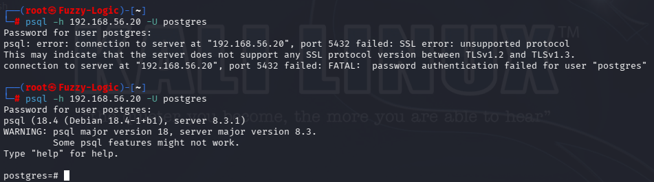
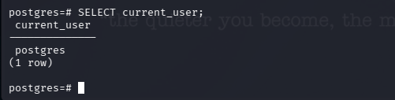
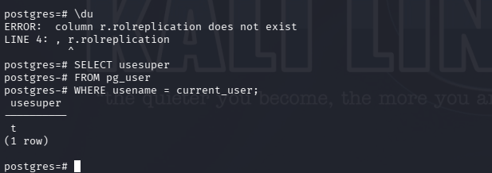
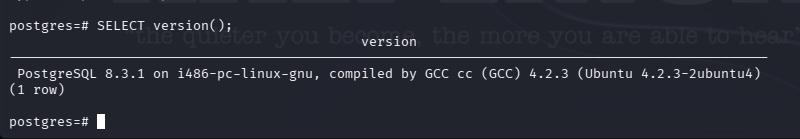
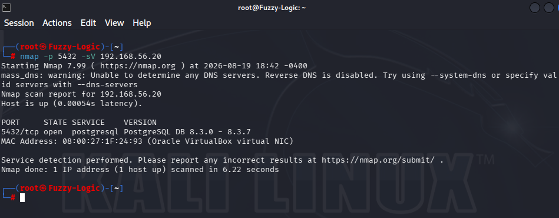

# PostgreSQL Security Findings

## Critical — Remote PostgreSQL Superuser Access

### Description

The PostgreSQL service was exposed remotely on TCP/5432 and allowed successful authentication using the highly privileged `postgres` account.

The connection was established using:

```bash
psql -h 192.168.56.20 -U postgres
```

The server requested password authentication and the connection was successfully established.



The authenticated identity was subsequently confirmed as:

```text
postgres
```

using:

```sql
SELECT current_user;
```



The account's privilege level was then explicitly verified:

```sql
SELECT usesuper
FROM pg_user
WHERE usename = current_user;
```

The server returned:

```text
usesuper
--------
t
```

The value `t` confirms that the authenticated account is a PostgreSQL superuser.



### Impact

A remotely accessible PostgreSQL superuser account represents a significant administrative exposure.

If the credentials for this account were compromised, an attacker could potentially obtain extensive control over the PostgreSQL environment, including access to databases, database objects, roles and other administrative functionality available to a PostgreSQL superuser.

The risk is increased because the service is directly reachable over the network.

### Severity

**Critical**

The Critical rating is based on the combination of:

```text
Remote database exposure
        +
Authenticated postgres account
        +
Confirmed superuser privileges
```

This finding does **not** claim unauthenticated access. Password authentication was required and successfully completed during the assessment.

### Recommendation

- Avoid routine remote access using the `postgres` superuser.
- Restrict administrative database access to trusted management hosts.
- Create dedicated administrative accounts where appropriate.
- Apply the principle of least privilege.
- Use strong authentication mechanisms and appropriately protected credentials.
- Review `pg_hba.conf` rules and restrict remote database access.
- Restrict TCP/5432 using network and host-based firewall controls.

---

## High — Legacy PostgreSQL Version

### Description

The target was running:

```text
PostgreSQL 8.3.1
```

The version was confirmed directly from the database server.



The initial Nmap service detection also identified the service as:

```text
PostgreSQL DB 8.3.0 - 8.3.7
```



### Impact

The server is running a very old PostgreSQL generation.

Legacy database software presents increased security and maintenance risks because it may lack modern security improvements, compatibility updates and supported security fixes.

The primary confirmed security issue in this assessment, however, is the remote exposure of a superuser account rather than the software age alone.

### Severity

**High**

### Recommendation

- Upgrade PostgreSQL to a supported release.
- Establish a regular patch-management lifecycle.
- Remove legacy database software where it is no longer required.
- Test application compatibility before performing the upgrade.
- Maintain supported database versions in production environments.

---

## High — Remote Database Service Exposure

### Description

PostgreSQL was directly accessible from the assessment host over:

```text
TCP/5432
```

Nmap confirmed the exposed service:

```text
5432/tcp open postgresql
```


Remote authentication was subsequently demonstrated using the `postgres` account.


### Impact

A database service exposed to broader networks provides an additional attack surface and permits remote authentication attempts.

The risk becomes substantially greater when highly privileged accounts are permitted to authenticate remotely.

### Severity

**High**

### Recommendation

- Restrict TCP/5432 to trusted application servers and authorized administration hosts.
- Review PostgreSQL network access rules.
- Restrict remote connections through `pg_hba.conf`.
- Apply host-based and network firewall controls.
- Avoid exposing database services directly to untrusted networks.

---

## Authentication Assessment

The PostgreSQL service **did require password authentication** during the assessment.

The initial connection attempt displayed:

```text
Password for user postgres:
```

A subsequent connection using the correct laboratory credentials succeeded.

Therefore, this assessment does **not** classify PostgreSQL as an unauthenticated or passwordless service.

The confirmed issue is instead:

**Remote authentication using a highly privileged PostgreSQL superuser account.**

This distinction is important when reporting the finding accurately.

---

## Client / Server Compatibility

During enumeration, the modern PostgreSQL 18 client generated compatibility errors when using legacy meta-commands such as:

```text
\l
\du
```

The errors included references to catalog columns that were not present in PostgreSQL 8.3.

For example:

```text
ERROR: column d.datcollate does not exist
```

and:

```text
ERROR: column r.rolreplication does not exist
```

These were treated as **tool compatibility issues**, not security vulnerabilities.

Direct SQL queries against the appropriate PostgreSQL 8.3 system catalog were used instead to validate the authenticated account and its privileges.

No finding is assigned to these compatibility errors.

---

## Evidence Chain

The PostgreSQL findings are supported by the following evidence.

### Service Identification

Nmap identified PostgreSQL on TCP/5432.


### Remote Authentication

A remote connection using the `postgres` account was successfully established.


### Version Identification

The server reported PostgreSQL 8.3.1.


### Authenticated Identity

The session was confirmed as:

```text
postgres
```


### Superuser Validation

The account was confirmed to have:

```text
usesuper = true
```


The complete evidence chain is:

**Service exposure → remote authentication → version identification → account identification → privilege validation**

---

## Remediation Priority

### Immediate

1. Restrict remote access to TCP/5432.
2. Review which hosts actually require PostgreSQL access.
3. Avoid using the `postgres` superuser for routine remote administration.
4. Review and harden `pg_hba.conf`.

### Short Term

5. Create dedicated administrative accounts where required.
6. Apply least-privilege permissions.
7. Strengthen authentication controls.
8. Review all remotely accessible PostgreSQL roles.

### Longer Term

9. Upgrade PostgreSQL to a supported version.
10. Establish regular database patching and security reviews.

---

## Scope and Limitations

The assessment was conducted against the intentionally vulnerable Metasploitable 2 laboratory environment.

Testing was limited to:

- Service identification.
- Version detection.
- Remote authentication validation.
- Current-user identification.
- Superuser privilege validation.
- Client/server compatibility troubleshooting.

No exploitation was performed.

No destructive database actions were performed.

No database contents were modified or deleted.

The assessment does not claim that the PostgreSQL service was accessible without authentication.

---

## Portfolio Conclusion

**"TCP/5432 exposed a legacy PostgreSQL 8.3.1 service. Remote password authentication using the `postgres` account was successfully established, and direct SQL queries confirmed that the authenticated account possessed PostgreSQL superuser privileges (`usesuper = true`). The combination of remote database exposure and highly privileged account access represents a critical security risk. The server's legacy PostgreSQL version represents an additional high-severity maintenance and security concern. No exploitation or destructive database actions were performed."**
