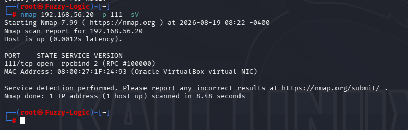
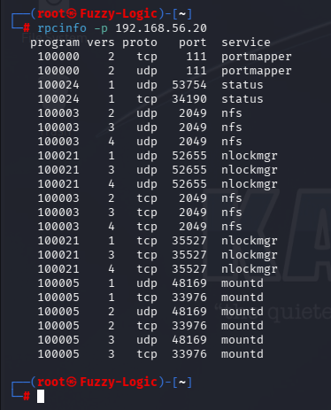

# RPC Enumeration

## Service Information

- **Service:** RPC / Portmapper
- **Ports:** TCP/111 and UDP/111
- **Protocol:** SunRPC
- **Target:** Metasploitable 2

## 1. RPC Service Discovery

The RPC portmapper service was identified using Nmap:

```bash
nmap 192.168.56.20 -p 111 -sV
```

Nmap identified TCP/111 as an RPC service:

```text
111/tcp open rpcbind 2 (RPC #100000)
```



Port 111 is commonly associated with the RPC portmapper, which maintains information about RPC programs registered on the host.

The detection confirmed that the target exposed an RPC portmapper service.

## 2. RPC Service Enumeration with rpcinfo

The registered RPC programs were then enumerated using:

```bash
rpcinfo -p 192.168.56.20
```

The command queries the remote RPC portmapper and displays the RPC programs registered on the target.



The enumeration identified the following RPC programs:

| Program | Service | Versions observed |
|---|---|---|
| `100000` | portmapper | 2 |
| `100024` | status | 1 |
| `100003` | nfs | 2, 3, 4 |
| `100021` | nlockmgr | 1, 3, 4 |
| `100005` | mountd | 1, 2, 3 |

The RPC services were registered over both TCP and UDP.

## 3. Interpreting the RPC Results

The enumeration identified several RPC-dependent services.

### Portmapper

```text
100000
```

The portmapper is responsible for maintaining information about RPC programs registered on the host.

Its presence on TCP/111 and UDP/111 allows RPC clients to determine which RPC services are available and where they can be accessed.

### NFS

```text
100003
```

NFS was registered with versions:

```text
2
3
4
```

NFS provides network-based filesystem access and therefore represents an important service to investigate further.

The presence of NFS was particularly relevant because the RPC enumeration demonstrated that the target was exposing a remote filesystem service.

### Nlockmgr

```text
100021
```

`nlockmgr` is associated with NFS file-locking functionality.

Multiple versions of the service were registered on the target.

### Mountd

```text
100005
```

`mountd` is associated with the mounting of exported NFS filesystems.

Its presence alongside NFS indicates that the host provides additional RPC functionality related to remote filesystem access.

### Status

```text
100024
```

The `status` RPC program was also registered on the target.

## 4. RPC Enumeration Findings

The RPC enumeration demonstrated that the target was not simply exposing port 111 in isolation.

The portmapper provided visibility into several registered RPC services:

```text
RPC portmapper
      |
      +-- status
      |
      +-- NFS
      |    |
      |    +-- NFS v2
      |    +-- NFS v3
      |    +-- NFS v4
      |
      +-- nlockmgr
      |
      +-- mountd
```

This is significant from a reconnaissance perspective because RPC enumeration revealed additional services that were not necessarily apparent from the initial port 111 scan alone.

## 5. Transition from RPC to NFS

The discovery of the following RPC programs:

```text
100003  nfs
100005  mountd
100021  nlockmgr
```

indicated that NFS required a dedicated security assessment.

The RPC assessment therefore provided the information needed to determine the next stage of the investigation.

The methodology was:

```text
RPC portmapper discovered
          ↓
RPC services enumerated
          ↓
NFS identified
          ↓
NFS versions identified
          ↓
Dedicated NFS assessment
```

This demonstrates how service enumeration can guide subsequent stages of a security assessment without requiring exploitation.

## Security Considerations

Exposed RPC services can disclose information about the services running on a host and increase the network attack surface.

The enumeration confirmed the presence of:

- RPC portmapper.
- NFS versions 2, 3 and 4.
- `mountd`.
- `nlockmgr`.
- `status`.

The actual security impact depends on the configuration and network accessibility of each service.

The RPC enumeration itself does not demonstrate a direct compromise.

## Assessment Scope

The RPC assessment was limited to service identification and enumeration.

No RPC exploitation was performed.

The purpose of the assessment was to identify registered RPC programs and determine whether any services required further investigation.

The discovery of NFS led directly to the subsequent NFS assessment.

## Enumeration Summary

The assessment established that:

- RPC portmapper was exposed on TCP/111.
- RPC services were registered on both TCP and UDP.
- `rpcinfo` successfully enumerated the registered RPC programs.
- NFS was registered as program `100003`.
- NFS versions 2, 3 and 4 were exposed.
- `mountd`, `nlockmgr` and `status` were also registered.
- The RPC enumeration provided the basis for the subsequent NFS assessment.

The evidence chain is:

**RPC service identification → RPC program enumeration → NFS identification → transition to NFS assessment**

## Commands

### RPC service detection

```bash
nmap 192.168.56.20 -p 111 -sV
```

### RPC program enumeration

```bash
rpcinfo -p 192.168.56.20
```

## Evidence Summary

The RPC assessment uses two screenshots:

```text
07_RPC01_nmap_rpc_portmapper.png
07_RPC02_rpcinfo_enumeration.png
```

The first demonstrates that the RPC portmapper is exposed.

The second provides the primary evidence for the services registered with the RPC framework.
