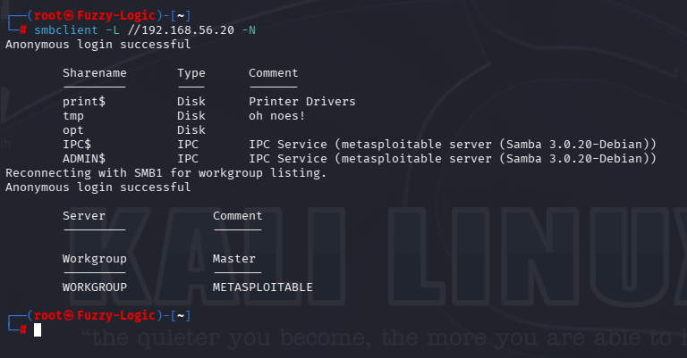
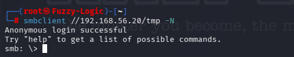
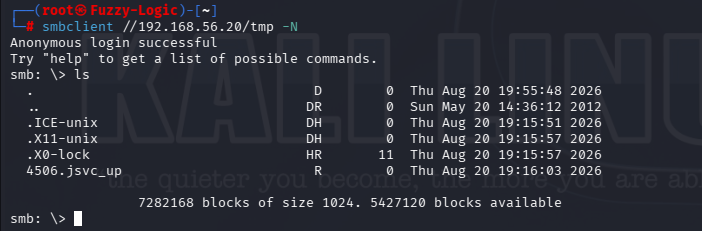
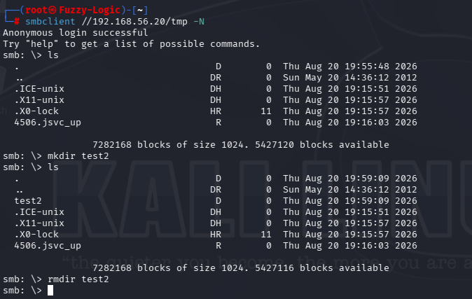
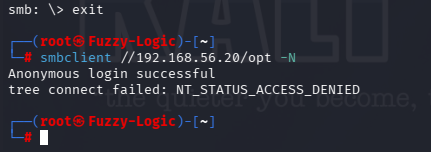

# Samba — TCP/445

## Service Assessment

**Service:** Samba / SMB

**Port:** TCP/445

**Software identified:** Samba 3.0.20-Debian

**Workgroup:** WORKGROUP

**SMB version:** SMB1 available

**Authentication:** Anonymous access permitted

**Shares discovered:** `print$`, `tmp`, `opt`, `IPC$`, `ADMIN$`

**Assessment approach:** SMB share enumeration and access-control validation. No exploitation was performed.

---

## Finding

The Samba service allowed anonymous SMB access.

We were able to enumerate the available shares without supplying a username or password and subsequently connect anonymously to the `tmp` share.

The `tmp` share permitted both anonymous read and write access. We verified write permissions safely by creating and removing a test directory.

The `opt` share was successfully enumerated but rejected anonymous access.

The presence of SMB1, combined with anonymous access and an anonymously writable share, represents a significant security misconfiguration.

---

# Detailed Assessment

## 1. Anonymous SMB Share Enumeration

We began by enumerating the SMB resources exposed by the target.

### Command used

```bash
smbclient -L //192.168.56.20 -N
```

The `-L` option requests a list of available SMB shares, while `-N` tells `smbclient` to connect without requesting a password.

The enumeration revealed the following resources:

```text
print$
tmp
opt
IPC$
ADMIN$
```

The assessment also identified the Samba service as:

```text
Samba 3.0.20-Debian
```

with:

```text
WORKGROUP
```

as the SMB workgroup.

The enumeration was performed successfully without supplying authentication credentials.

### Evidence



**Key observation:** SMB resources could be enumerated anonymously.

---

## 2. Anonymous Access to the `tmp` Share

After identifying the available shares, we tested the `tmp` resource directly.

### Command used

```bash
smbclient //192.168.56.20/tmp -N
```

The connection succeeded without requesting credentials.

This confirmed that the `tmp` share permitted anonymous access.

### Evidence



**Key observation:** The `tmp` share accepted an anonymous SMB connection.

---

## 3. Testing Read Access

Once connected to the `tmp` share, we checked whether we could inspect its contents.

### Command used

```text
ls
```

The command successfully returned the contents of the share.

This demonstrated that anonymous users had read access to the `tmp` share.

The important finding is therefore not simply that the share existed, but that an unauthenticated user could interact with its contents.

### Evidence



**Key observation:** Anonymous users could list the contents of the `tmp` share.

---

## 4. Testing Anonymous Write Access

We then tested whether the anonymous session had write permissions.

Rather than modifying an existing file, we used a temporary directory specifically for permission validation.

### Command used

```text
mkdir test2
```

The directory was successfully created.

We then removed it:

```text
rmdir test2
```

This confirmed that the anonymous session had write permissions on the `tmp` share.

This was a controlled permissions test: a temporary directory was created specifically to validate write access and was immediately removed.

### Evidence



**Key observation:** An unauthenticated SMB session could create and remove a directory.

---

## 5. Testing the `opt` Share

We also tested another resource discovered during enumeration.

### Command used

```bash
smbclient //192.168.56.20/opt -N
```

Unlike `tmp`, this resource rejected anonymous access.

The server returned:

```text
NT_STATUS_ACCESS_DENIED
```

This comparison was useful because it demonstrated that anonymous access was not universally permitted across every SMB share.

The `opt` share was visible during enumeration, but its contents were protected against unauthenticated access.

### Evidence



**Key observation:** The `opt` share was enumerated but rejected anonymous access.

---

# SMB Resources Assessed

| Resource | Anonymous access | Read | Write |
|---|---|---|---|
| `tmp` | Allowed | Verified | Verified |
| `opt` | Denied | — | — |
| `print$` | Enumerated | Not verified | Not verified |
| `IPC$` | Enumerated | Not assessed | Not assessed |
| `ADMIN$` | Enumerated | Not assessed | Not assessed |

This table deliberately reflects only what was actually verified during the assessment.

We do **not** claim read or write permissions for `print$`, `IPC$` or `ADMIN$` because those permissions were not tested.

---

# Security Assessment

## Anonymous SMB Access

The Samba service allowed unauthenticated users to enumerate SMB resources:

```bash
smbclient -L //192.168.56.20 -N
```

No username or password was required.

**Impact:**

An unauthenticated network user could discover information about the SMB resources exposed by the server.

**Severity:** Medium

**Recommendation:**

Disable anonymous SMB access unless it is explicitly required. SMB shares should require authentication and appropriate authorization.

---

## Anonymous Read/Write Access to `tmp`

The `tmp` share presented the most significant finding.

We verified that an anonymous user could:

- Connect to the share.
- List its contents.
- Create a directory.
- Remove the directory.

The critical evidence was:

```text
mkdir test2
```

followed by:

```text
rmdir test2
```

This proves that the anonymous session had write access.

**Impact:**

An unauthenticated user could modify the contents of an SMB-accessible resource.

Depending on how the share is used by the underlying operating system or applications, this could create additional security risks.

For this assessment, we stopped after proving write access and did not attempt further exploitation.

**Severity:** High

**Recommendation:**

- Disable anonymous access.
- Remove write permissions from unauthenticated users.
- Apply least-privilege permissions.
- Review whether the `tmp` share is actually required.
- Restrict SMB access to trusted networks.

---

## SMB1 Available

The assessment identified SMB1 as available on the server.

SMB1 is an obsolete protocol version and should not normally be enabled on modern systems.

**Impact:**

Maintaining legacy protocol support increases the attack surface and may expose the environment to vulnerabilities associated with obsolete SMB implementations.

**Severity:** High

**Recommendation:**

Disable SMB1 and use a current SMB protocol version where compatibility allows.

---

# Evidence

The evidence collected for this assessment is:

```text
08_SAMBA/
├── 08_SAMBA01_smb_anonymous_enumeration.png
├── 08_SAMBA02_smb_tmp_anonymous_access.png
├── 08_SAMBA03_smb_tmp_read_access.png
├── 08_SAMBA04_smb_tmp_write_access.png
└── 08_SAMBA05_smb_denied_access.png
```

The evidence chain is:

**SMB discovery → anonymous enumeration → share identification → anonymous `tmp` access → read validation → write-permission validation → access-control comparison**

The `opt` denial is useful supporting evidence because it demonstrates that the assessment distinguished between shares that were anonymously accessible and shares that rejected anonymous access.

---

# Commands

## Enumerate SMB resources anonymously

```bash
smbclient -L //192.168.56.20 -N
```

## Connect anonymously to `tmp`

```bash
smbclient //192.168.56.20/tmp -N
```

## List contents of the share

```text
ls
```

## Test write permission

```text
mkdir test2
```

## Remove the test directory

```text
rmdir test2
```

## Test anonymous access to `opt`

```bash
smbclient //192.168.56.20/opt -N
```

---

# Portfolio Conclusion

> **"TCP/445 exposed Samba 3.0.20-Debian with SMB1 available and anonymous SMB access permitted. Anonymous enumeration revealed multiple SMB resources, including `print$`, `tmp`, `opt`, `IPC$` and `ADMIN$`. The `tmp` share was accessible without authentication and allowed both read and write operations. Write access was safely validated by creating and subsequently removing a test directory. In contrast, the `opt` share was enumerated but rejected anonymous access. The primary findings were anonymous SMB access, an anonymously writable share, and the presence of the obsolete SMB1 protocol. No exploitation was performed."**

## Assessment Chain

**SMB discovery → anonymous enumeration → share identification → anonymous `tmp` access → read validation → write-permission validation → security finding**
