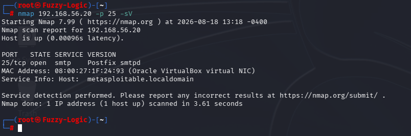
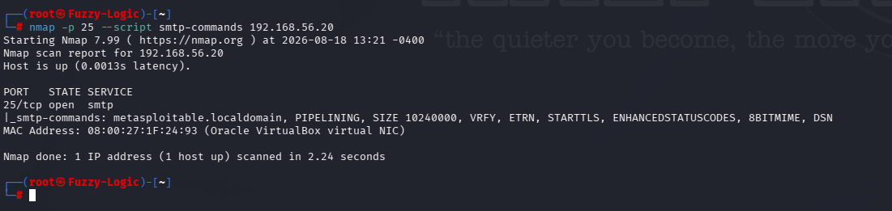
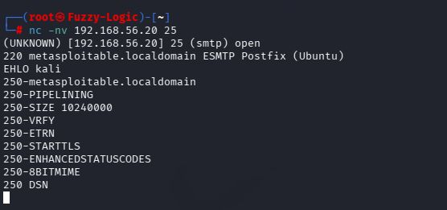

# SMTP Enumeration

## Service Information

- **Service:** SMTP
- **Port:** TCP/25
- **Software:** Postfix SMTP
- **Target:** Metasploitable 2

## Service Discovery

The SMTP service was identified during the reconnaissance phase using Nmap.

The service-specific scan was performed with:

```bash
nmap 192.168.56.20 -p 25 -sV
```

Nmap identified TCP/25 as an open SMTP service running Postfix:

```text
25/tcp open smtp Postfix smtpd
```



The scan confirmed that the target was exposing an SMTP service on TCP/25.

## SMTP Command Enumeration

Nmap's `smtp-commands` script was used to enumerate the SMTP commands and extensions supported by the server.

The following command was executed:

```bash
nmap -p 25 --script smtp-commands 192.168.56.20
```

The server reported the following capabilities:

```text
metasploitable.localdomain
PIPELINING
SIZE 10240000
VRFY
ETRN
STARTTLS
ENHANCEDSTATUSCODES
8BITMIME
DSN
```



The enumeration demonstrated that the SMTP service exposed several standard SMTP capabilities, including `VRFY`, `ETRN` and `STARTTLS`.

The presence of these commands does not by itself demonstrate a vulnerability. Their security impact depends on the server configuration and how the functionality is exposed.

## Manual SMTP Connection

The SMTP service was also accessed directly using Netcat:

```bash
nc -nv 192.168.56.20 25
```

The server returned the following SMTP banner:

```text
220 metasploitable.localdomain ESMTP Postfix (Ubuntu)
```



The banner disclosed the SMTP implementation and the hostname configured on the service.

## SMTP EHLO Enumeration

After establishing the connection, the SMTP greeting was issued:

```text
EHLO kali
```

The server responded with its supported SMTP extensions:

```text
250-metasploitable.localdomain
250-PIPELINING
250-SIZE 10240000
250-VRFY
250-ETRN
250-STARTTLS
250-ENHANCEDSTATUSCODES
250-8BITMIME
250 DSN
```

This confirmed the capabilities previously identified through Nmap and demonstrated that the SMTP server actively advertised these extensions during a normal SMTP session.

## Security Considerations

The SMTP enumeration identified several characteristics that should be considered during the security assessment:

- The SMTP service is exposed on TCP/25.
- The server identifies itself as Postfix.
- The SMTP banner discloses the configured hostname.
- The server advertises several SMTP extensions.
- `VRFY` is enabled and may warrant review because SMTP user-verification functionality can potentially contribute to account enumeration.
- `ETRN` is enabled and should be restricted according to the intended mail-server configuration.
- `STARTTLS` is advertised, although the assessment did not perform a complete TLS configuration review.
- The assessment did not test whether the server permits unauthenticated mail relay.

The presence of these features does not by itself constitute a confirmed vulnerability. Further configuration review would be required to determine whether any of them are unnecessarily exposed or insecurely configured.

## Enumeration Summary

The SMTP enumeration established the following characteristics:

- TCP/25 was exposed on the target.
- Nmap identified the service as Postfix SMTP.
- The SMTP server advertised the hostname `metasploitable.localdomain`.
- Nmap identified the supported SMTP commands and extensions.
- A direct connection to the SMTP service was successfully established.
- The server responded to `EHLO kali` and advertised the same SMTP capabilities observed through Nmap.
- `VRFY` and `ETRN` were exposed by the service.
- No open-relay testing or exploitation was performed.

These observations were used as the basis for the subsequent SMTP security findings.

## Scope and Limitations

The assessment was conducted against the intentionally vulnerable Metasploitable 2 laboratory environment.

The SMTP service was identified and enumerated using Nmap and Netcat. The assessment focused on service exposure, advertised functionality and information disclosure without attempting exploitation, unauthorized mail delivery or open-relay abuse.
