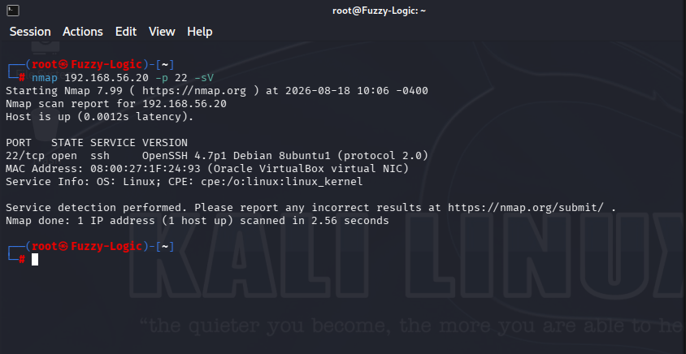
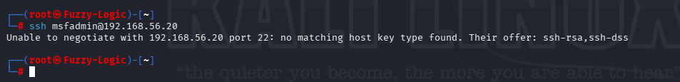
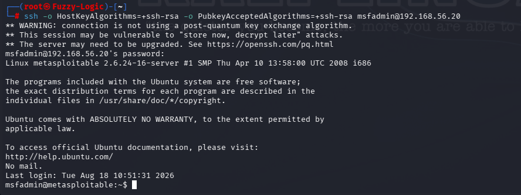
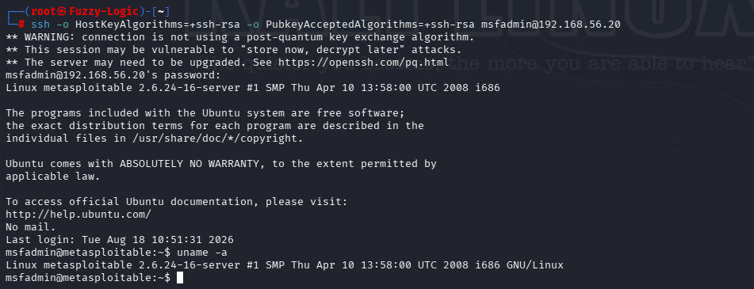

# SSH Security Findings

## Overview

The SSH service exposed by the Metasploitable 2 host presented several security weaknesses identified during the service assessment.

The assessment identified three primary findings:

1. **Outdated SSH Software — OpenSSH 4.7p1**
2. **Legacy Cryptographic Algorithms — ssh-rsa / ssh-dss**
3. **Remote Authentication Exposure — msfadmin**

The findings were identified through service detection, cryptographic configuration assessment and non-destructive authentication testing.

No exploitation, privilege escalation or persistence was performed as part of this assessment.

---

## Finding 01 — Outdated SSH Software

### Description

The SSH service was running **OpenSSH 4.7p1 Debian 8ubuntu1**, an obsolete version of the OpenSSH server.

The service version was identified through Nmap service and version detection.

### Evidence

The SSH service and version were identified during the enumeration phase:



The detected service was:

```text
22/tcp open ssh OpenSSH 4.7p1 Debian 8ubuntu1 (protocol 2.0)
```

### Security Impact

Running an obsolete network-facing SSH implementation increases the risk of exposure to known vulnerabilities and means that the service lacks security improvements introduced in subsequently supported releases.

The underlying operating system was also identified as a legacy Linux environment, increasing the overall security risk associated with the outdated software stack.

### Severity

**High**

The severity reflects the exposure of an obsolete remote-access service and the age of the underlying software environment.

### Recommendation

- Upgrade OpenSSH to a currently supported version.
- Maintain the underlying operating system with current security updates.
- Remove obsolete packages and services.
- Establish a regular patch and vulnerability management process.
- Restrict SSH access to trusted networks or hosts.

---

## Finding 02 — Legacy Cryptographic Algorithms

### Description

The SSH server exposed legacy host-key algorithms including:

- `ssh-rsa`
- `ssh-dss`

A modern SSH client initially rejected the connection because these algorithms were not accepted by its current security policy.

The server reported:

```text
Unable to negotiate with 192.168.56.20 port 22:
no matching host key type found.
Their offer: ssh-rsa,ssh-dss
```

### Evidence

The initial connection attempt demonstrated the legacy algorithm incompatibility:



The connection was subsequently established after explicitly enabling compatibility with `ssh-rsa`.



### Security Impact

Legacy cryptographic algorithms may provide weaker security guarantees and can prevent the SSH service from meeting modern cryptographic security policies.

In particular, `ssh-dss` is considered obsolete, while RSA/SHA-1 signatures have been deprecated in modern SSH implementations.

The finding therefore represents a cryptographic configuration weakness that should be addressed as part of the SSH hardening process.

### Severity

**Medium**

The finding represents a significant hardening and cryptographic compatibility issue, although no direct compromise was demonstrated during the assessment.

### Recommendation

- Disable `ssh-dss`.
- Migrate away from SHA-1-based RSA signatures.
- Prefer modern host-key algorithms such as Ed25519 where supported.
- Review the SSH server's `sshd_config` and cryptographic policy.
- Ensure SSH configuration complies with current organizational security standards.

---

## Finding 03 — Remote Authentication Exposure

### Description

The SSH service permitted remote authentication using the local `msfadmin` account.

After the legacy host-key compatibility requirement was addressed, an interactive SSH session was successfully established.

The connection was performed using:

```bash
ssh -o HostKeyAlgorithms=+ssh-rsa -o PubkeyAcceptedAlgorithms=+ssh-rsa msfadmin@192.168.56.20
```

The resulting session provided an interactive shell under the `msfadmin` account.

### Evidence

The successful authenticated SSH session is documented here:


The session was subsequently used to collect system information:



### Security Impact

SSH provides an interactive remote administration interface.

If an account's credentials are weak, reused or compromised, an attacker could potentially obtain direct access to the operating system through the exposed SSH service.

The assessment confirmed that remote authentication was possible, but it did **not** attempt password cracking, credential theft, privilege escalation or persistence.

### Severity

**Medium**

The finding reflects the exposure of an interactive remote authentication service and the potential consequences of compromised credentials.

### Recommendation

- Use strong, unique credentials.
- Prefer public-key authentication where appropriate.
- Disable password authentication where practical.
- Restrict SSH access through firewall rules or network segmentation.
- Remove or disable unnecessary accounts.
- Apply appropriate account lockout and authentication controls.
- Monitor SSH authentication activity for suspicious behaviour.

---

## Overall Assessment

The SSH service presents a significant security risk due to the combination of **obsolete software**, **legacy cryptographic algorithms** and **remote authentication exposure**.

The assessment confirmed that:

- OpenSSH 4.7p1 was exposed on TCP/22.
- The server offered legacy host-key algorithms including `ssh-rsa` and `ssh-dss`.
- A modern SSH client initially rejected the connection because of the legacy algorithm configuration.
- Compatibility with `ssh-rsa` allowed an authenticated SSH session to be established.
- The `msfadmin` account provided interactive remote access.
- The underlying system was identified as a legacy Linux environment running kernel 2.6.24.

These weaknesses should be addressed through software and operating-system updates, modern cryptographic configuration, appropriate authentication controls and network-level restrictions.

No exploitation or privilege escalation was performed during this assessment.
