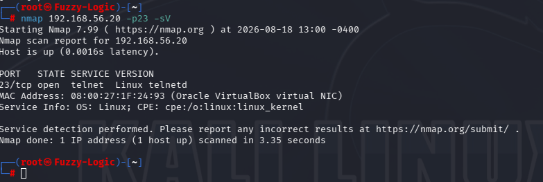
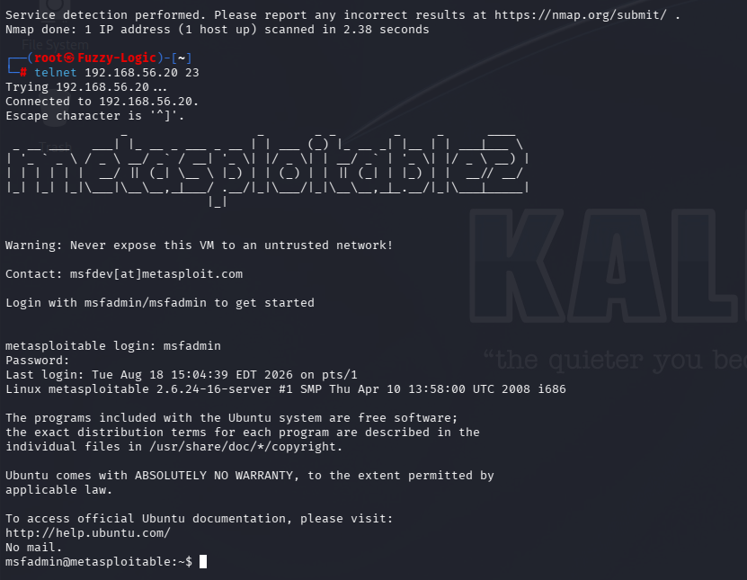

# Telnet Enumeration

## Service Information

- **Service:** Telnet
- **Port:** TCP/23
- **Protocol:** Telnet
- **Target:** Metasploitable 2

## Service Discovery

The Telnet service was identified during the reconnaissance phase using Nmap.

The service-specific scan was performed with:

```bash
nmap 192.168.56.20 -p 23 -sV
```

Nmap identified TCP/23 as an open Telnet service:

```text
23/tcp open telnet Linux telnetd
```



The scan confirmed that the target was exposing a Telnet service and that the service was reachable from the assessment host.

## Manual Telnet Connection

After identifying the service, a direct connection was established using the Telnet client:

```bash
telnet 192.168.56.20 23
```

The connection was successfully established:

```text
Trying 192.168.56.20...
Connected to 192.168.56.20.
Escape character is '^]'.
```

The successful connection confirmed that TCP/23 was not merely responding to service detection, but was accepting interactive Telnet connections.

## Remote Authentication

After establishing the Telnet connection, valid laboratory credentials were supplied to authenticate to the remote system.

The session successfully authenticated using the `msfadmin` account and provided an interactive shell:

```text
metasploitable login: msfadmin
Password:
Last login: Tue Aug 18 15:04:39 EDT 2026 on pts/1
Linux metasploitable 2.6.24-16-server #1 SMP Thu Apr 10 13:58:00 UTC 2008 i686
msfadmin@metasploitable:~$
```



This demonstrated that the Telnet service permitted remote interactive authentication using a local system account.

No exploitation, privilege escalation or persistence was performed.

## Security Characteristics

The primary security concern identified during the Telnet assessment is the use of an inherently unencrypted remote administration protocol.

Unlike SSH, Telnet does not provide encryption for the transport layer. Authentication credentials and interactive session data may therefore be exposed to an attacker capable of observing the network traffic.

The assessment did not perform packet interception or credential capture. The security impact described here is based on the inherent security characteristics of the Telnet protocol.

## Enumeration Summary

The Telnet enumeration established the following characteristics:

- TCP/23 was exposed on the target.
- Nmap identified the service as Linux telnetd.
- A direct Telnet connection was successfully established.
- The service permitted remote authentication using the `msfadmin` account.
- An interactive shell was obtained through the Telnet session.
- Telnet provides no transport encryption for authentication or session data.

These observations were used as the basis for the subsequent Telnet security findings.

## Scope and Limitations

The assessment was conducted against the intentionally vulnerable Metasploitable 2 laboratory environment.

The Telnet service was identified, accessed and assessed without attempting credential interception, exploitation, privilege escalation or persistence.
