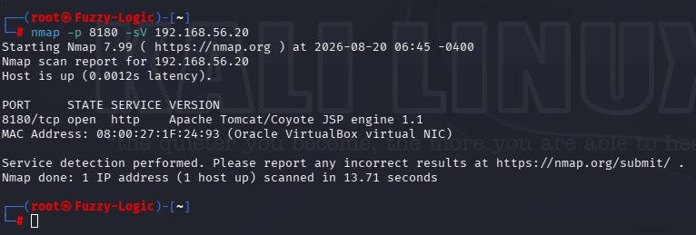
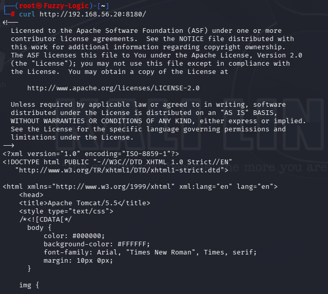
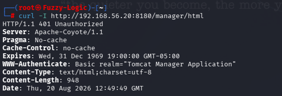
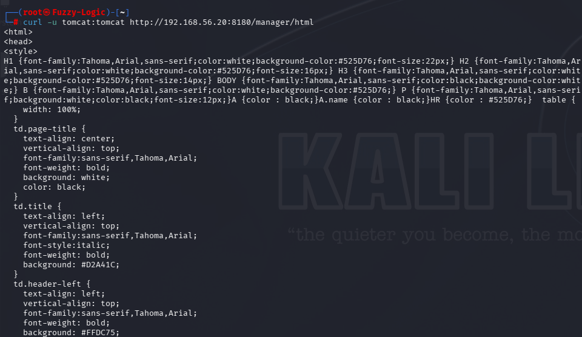
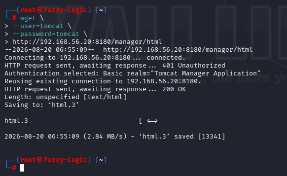
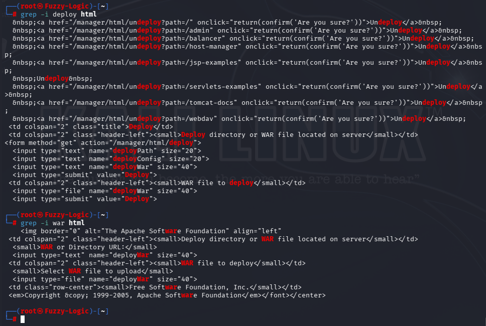
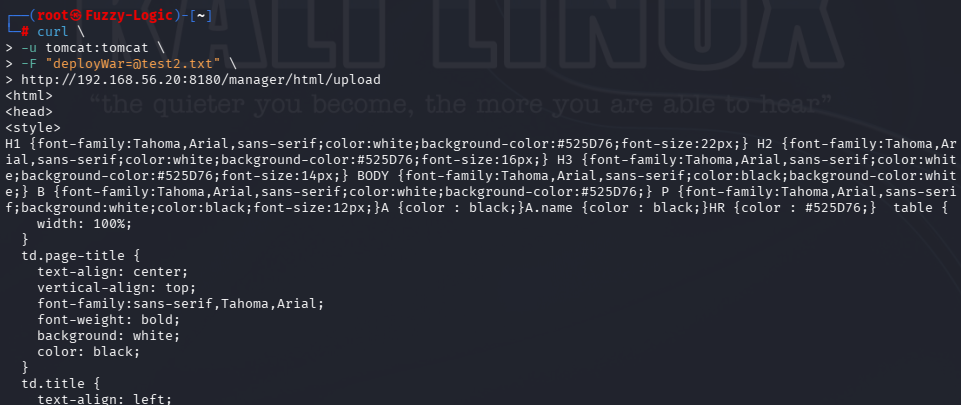

# LEGACY APACHE TOMCAT VERSION - FINDINGS

## Finding 01 — Legacy Apache Tomcat Version

**Severity:** High

**Service:** Apache Tomcat

**Port:** TCP/8180

### Description

The target was identified as running:

```text
Apache Tomcat/5.5
```

Nmap identified the HTTP service as:

```text
8180/tcp open http Apache Tomcat/Coyote JSP engine 1.1
```



The Tomcat version was subsequently confirmed through the default web interface.

The web interface reported:

```text
Apache Tomcat/5.5
```



### Security Impact

Tomcat 5.5 is a legacy and obsolete software generation.

Running obsolete server software increases the risk of:

- Known vulnerabilities.
- Unsupported components.
- Missing security fixes.
- Insecure legacy configurations.
- Compatibility and maintenance issues.

The version itself does not demonstrate exploitation during this assessment. The finding is based on the confirmed use of obsolete server software.

### Recommendation

- Upgrade to a currently supported Apache Tomcat release.
- Remove obsolete Tomcat installations where they are no longer required.
- Maintain a regular patch and software lifecycle process.
- Validate application compatibility before upgrading.


## Finding 02 — Exposed Tomcat Manager Application

**Severity:** High

**Service:** Apache Tomcat Manager

**Port:** TCP/8180

### Description

The Tomcat Manager application was directly accessible through:

```text
http://192.168.56.20:8180/manager/html
```

An unauthenticated request returned:

```text
HTTP/1.1 401 Unauthorized
```

with:

```text
WWW-Authenticate: Basic realm="Tomcat Manager Application"
```

This confirmed that the Manager application was remotely reachable and protected by HTTP Basic Authentication.



The application was subsequently accessed successfully using valid credentials.



### Security Impact

Administrative management interfaces should not normally be exposed broadly to untrusted networks.

Even when authentication is enabled, remote exposure of the Manager application increases the attack surface and provides a potential entry point to administrative functionality.

The risk is substantially increased when weak credentials are used, as demonstrated by the subsequent finding.

### Recommendation

- Restrict access to the Tomcat Manager application to trusted administration hosts.
- Apply network-level access controls and firewall rules.
- Disable the Manager application if it is not required.
- Avoid exposing administrative interfaces to untrusted networks.
- Review access controls regularly.


## Finding 03 — Weak / Default Tomcat Manager Credentials

**Severity:** Critical

**Service:** Apache Tomcat Manager

**Port:** TCP/8180

### Description

The credentials:

```text
tomcat:tomcat
```

successfully authenticated to the remotely accessible Tomcat Manager application.

The authenticated session provided access to the Tomcat Manager administrative interface.


The same credentials were also successfully used with `wget` to retrieve the authenticated Manager interface:



### Security Impact

The use of weak/default credentials for an administrative interface represents a significant authentication and access-control weakness.

An attacker who discovers or guesses these credentials could potentially obtain access to Tomcat management functionality.

The impact is particularly significant because the credentials provide access to the **Tomcat Manager application**, rather than merely to a normal application account.

### Recommendation

- Remove default credentials.
- Use unique and strong administrative credentials.
- Avoid using predictable usernames and passwords.
- Apply least privilege to Tomcat administrative accounts.
- Restrict Manager access to trusted source networks.
- Disable the Manager application when it is not required.
- Review Tomcat user configuration regularly.


## Finding 04 — Administrative Application Deployment Functionality

**Severity:** Critical

**Service:** Apache Tomcat Manager

**Port:** TCP/8180

### Description

The authenticated Tomcat Manager interface exposed administrative deployment functionality.

Inspection of the Manager HTML identified:

```text
Deploy directory or WAR file located on server
```

and:

```text
WAR file to deploy
```

The interface also exposed:

```text
WAR or Directory URL:
```

and:

```text
Select WAR file to upload
```

The upload form targeted:

```text
/manager/html/upload
```



This demonstrates that an authenticated Manager user had access to application deployment functionality capable of modifying the applications hosted by Tomcat.

### Security Impact

Application deployment is administrative functionality.

If an attacker obtained valid Manager credentials, this functionality could potentially be abused to introduce unauthorized applications into the Tomcat environment.

The assessment did **not** deploy a malicious WAR or attempt code execution.

The confirmed finding is the exposure of administrative deployment functionality to an account authenticated using weak/default credentials.

### Recommendation

- Disable application deployment functionality where it is not required.
- Restrict Tomcat Manager access to trusted administration hosts.
- Remove weak/default credentials.
- Apply least privilege to Tomcat administrative accounts.
- Monitor administrative deployment activity.
- Disable the Manager application entirely when it is not required.


## Supporting Observation — Controlled Upload-Endpoint Test

During the assessment, the identified upload endpoint was tested using a harmless text file.

A temporary file was created:

```bash
echo "hello" > test2.txt
```

The file was then submitted to:

```text
/manager/html/upload
```

using:

```bash
curl \
-u tomcat:tomcat \
-F "deployWar=@test2.txt" \
http://192.168.56.20:8180/manager/html/upload
```



This was a **controlled validation test**.

The test did not involve:

- A malicious WAR file.
- Code execution.
- Persistence.
- Privilege escalation.
- Destructive modification.

The evidence therefore supports the existence and accessibility of the upload functionality, but does **not** claim successful malicious application deployment or remote code execution.


## Portfolio Conclusion

**"TCP/8180 exposed an Apache Tomcat 5.5 installation. The Tomcat Manager application was remotely accessible and protected by HTTP Basic Authentication. The credentials `tomcat:tomcat` successfully authenticated to the Manager interface, which exposed administrative deployment and WAR upload functionality. A controlled upload-endpoint test was performed using a harmless text file. No malicious WAR was deployed, and no code execution or persistence was attempted."**
